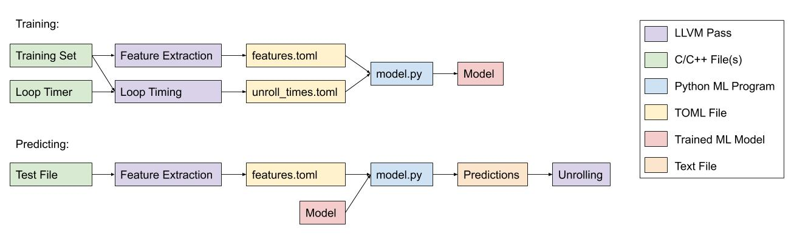

## Projects 

### LLVML - A Machine Learning framework for LLVM loop unrolling
Designed and implemented a Machine Learning to predict the optimal unroll factor of a loop in LLVM. Focused on the Feature Extraction step of the pipeline. Our Neural Network predicted the top two unroll factors in over 95% of cases. The paper can be found [here](https://drive.google.com/file/d/1jvSS3FYq7l4NvZA9LoVWhc9icNXR7bOR/view?usp=sharing).

### Various Natural Language Processing tasks 
description 
[Link to the paper](https://drive.google.com/file/d/1bV3wNY6OgIMXWMPDYI6-TytcHOhjUtXD/view?usp=sharing)

### InstaClone
 Implemented an Instagram clone based on a Python Flask backend controller using a REST API. Backend communicated with a MySQL database. Built the frontend in ReactJS and published the project on AWS.

 ### MapReduce Server 
 Implemented a MapReduce server capable of processing an arbitrary number of files in Python. Used one master controller and an arbitrary number of workers communicating through a REST API using Python socket and thread libraries extensively.